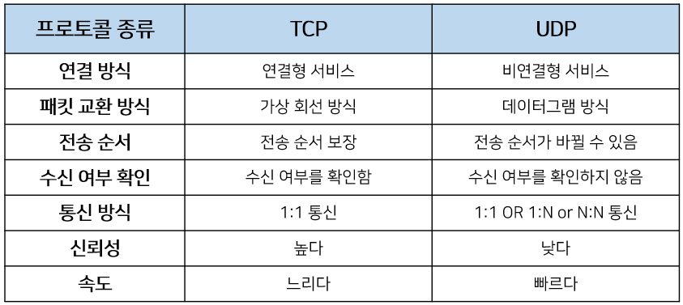

# 제목 없음

# 네트워크

## 웹 동작 방식

1. .사용자가 브라우저에 URL을 입력합니다.
2. 브라우저는 DNS를 통해 서버의 진짜 주소(IP)를 찾습니다.
3. HTTP 프로토콜을 사용하여 HTTP 요청 메세지를 생성합니다.
4. TCP/IP 연결을 통해 HTTP 요청이 서버로 전송됩니다.
5. 서버는 클라이언트의 요청에 해당하는 응답을 생성합니다.
6. 서버는 HTTP 프로토콜을 활용해 HTTP 응답 메세지를 생성합니다.
7. TCP/IP 연결을 통해 서버에서 생성한 HTTP 응답 메세지를 요청한 컴퓨터로 전송합니다.
8. 도착한 HTTP 응답 메세지는 웹페이지 데이터로 변환되고, 웹 브라우저에 의해 출력되어 사용자가 볼 수 있게 됩니다.

## TCP와 UDP 차이

TCP는 연결형 서비스로 3-way handshaking 과정을 통해 연결을 설정한다.

그렇기 때문에 높은 신뢰성을 보장하지만 속도가 비교적 느리다는 단점이 있다.

신뢰성이 있기 때문에 재전송이 가능하고 시퀸스 넘버와 ack넘버 값을 보고 재전송을 한다.

연결 종료시에는 4-way handshaking과정을 수행한다.

- UDP는 비연결형 서비스로 신뢰성이 떨어지지만 수신 여부를 확인하지 않기 때문에 속도가 빠릅니다.
- TCP는 신뢰성이 중요한 파일 교환과 같은 경우에 사용하고 UDP는 실시간성이 중요한 스트리밍에 자주 사용됩니다.

## TCP의 3-way Handshake 란?

TCP의 3 way handshake는 TCP/IP 프로토콜을 이용해서 통신을 하는 응용프로그램이 데이터를 전송하기 전에 먼저 정확한 전송을 보장하기 위해 상대방 컴퓨터와 사전에 세션을 수립하는 과정을 의미한다.

양쪽 모두 데이터를 전송할 준비가 되었다는 것을 보장하고 실제로 데이터 전달이 시작되기 전에 상대방이 준비가 되었다는 것을 알게 해준다. 이때 서로가 자신의 초기 순차 일련번호를 얻을 수 있도록 한다.

1. 클라이언트는 서버에 접속을 요청하는 SYN패킷을 보낸다. 이때 클라이언트는 SYN을 보내고 SYN/ACK 응답을 기다리는 SYN_SENT상태가 된다.
2. 서버는 SYN요청을 받고 클라이언트에게 요청을 수락한다는 ACK와 SYN flag가 설정된 패킷을 보내고 클라이언트가 ACK로 응답하기를 기다린다. 이때 t서버는 SYN_RECEIVED상태가 된다.
3. 클라이언트는 서버에 ACK를 보내고, 이후부터 연결이 이루어지고 데이터가 오간다. 이때 서버는 ESTABLISHED 상대다.

## TCP의 4-way handshake 란?

4 way handshake는 세션을 종료할 때 수행하는 절차다.

1. 클라이언트가 서버에 연결을 종료하겠다는 FIN flag를 전송한다.
2. 서버는 우선 확인 메세지를 보내고 자신의 통신이 끝날 때 까지 대기한다. TIME_WAIT 상태
3. 통신이 종료된 서버가 연결이 종료되었다고 클라이언트에게 FIN flag를 전송한다.
4. 클라이언트는 서버에 확인했다는 메세지를 보낸다.

## GET과 POST 차이

GET은 서버로부터 정보를 조회하기 위해 설계된 메소드입니다. 요청을 전송할 때 필요한 데이터를 Body에 담지 않고, 쿼리스트링을 통해 전송합니다. 또한 불필요한 요청을 제한하기 위해 요청이 캐시될 수 있습니다.

POST는 리소스를 생성/변경하기 위해 설계되었기 때문에 GET과 달이 전송해야될 데이터를 HTTP 메세지의 Body에 담아서 전송합니다. 길이의 제한없이 데이터를 전송할 수 있습니다. GET보다는 안정하지만 크롬의 개발자도구와 같은 여러 툴들로 요청 내용을 확인할 수 있기 때문에 민감 데이터는 암호화를 필요로합니다.

요청 헤더에 Content-Type에 요청 데이터의 타입을 표시해야합니다. 그렇지 않으면 서버는 내용이나 URL에 포함된 리소스 확장자명 등으로 데이터 타입을 유추합니다.

둘의 차이첨으로 멱등성에 대한 내용이 있습니다. 여기서 멱등이란 `동일한 연산을 여러 번 수행하더라도 동일한 결과` 를 보장하는 것입니다. GET은 서버에게 동일한 요청을 여러 번 전송하더라도 동일한 응답이 돌아와야 된다는 것이고, POST는 서버에게 동일한 요청을 여러 번 전송할 때 응답은 항상 다를 수 있다. 라는 뜻을 의미합니다.

## 공인 IP와 사설 IP 차이

- 공인 IP
    - 전세계에서 유일한 IP로 ISP(인터넷 서비스 공급자)가 제공하는 IP주소
    - 외부에 공개되어 있기 때문에 인터넷에 연결된 다른 장비로부터 접근이 가능하다.
    - 그에 따라 방화벽 등과 같은 보안 설정을 해주어야 한다.
- 사설 IP
    - 어떤 네트워크 안에서 사용되는 IP주소
    - IPV4의 부족으로 인해 모든 네트워크가 공인 IP를 사용하는 것이 불가능하기 때문에 네트워크 안에서 라우터를 통해 할당받는 가상의 주소이다.
    - 별도의 설정 없이는 외부에서 접근이 불가능하다.

Internet Protocol의 약자로써 `인터넷 영역에서 자기 자신의 PC를 나타내는 고유한 식별자 주소` 입니다.

## IP주소란?

PC뿐 아니라 서버들도 각자의 IP를 가지고 있어 IP주소를 통해 서버에 접근하고 데이터를 송수신할 수 있습니다.

이러한 IP주소에는 번호 영역(클래스)이 존재하는데, 이러한 번호 영역 종류중에 IPv4, IPv6 체계가 있습니다.

## IPv4 와 IPv6 는 무엇이고, 어떤 차이가 있나요?

IPv4는 한 자리당 0~255까지 8비트로 표현이 가능하며, 총 32비트를 가진 IP번호 체계 입니다. 대략 40억개로 표현할 수 있지만 현재 대부분의 주소를 사용하고 있어, IPv6가 대두되고 있습니다.

IPv6는 총 128비트의 체계로써, 한자리당 16비트 씩 8개를 가지고 있습니다. ex) 2000:201:abcc:ffff:0000:00001:aaaa:2222

IPv6는 IP번호를 나타내는 것 뿐 아니라 QoS 요구 실시간 서비스를 제공하며, 보안 기능이 강화되었습니다.

## QoS 요구 실시간 서비스 란?

QoS(Quality of Service)는 네트워크 디바이스가 트래픽을 구별한 후에 트래픽에 서로 다른 동작을 적용할 수 있도록 해줍니다.

## 웹 접근성의 국제표준

웹 접근성을 높이기 위해 고안된 웹 표준은 웹에서 표준적으로 사용되는 기술이나 규칙을 의미합니다. 웹 표준을 정하기 위해 W3C(World Wide Web Consortinum)이 설립되었으며 웹 표준으로 구조 언어인 HTML, 표현 언어인 CSS, 동작 언어인 Script를 지정하였습니다.

## OSI 7 계층 및 TCP/IP 계층

OSI 7 계층: 통신 접속에서 완료까지 과정을 7단계로 정의한 국제 표준 규약

TCP/IP 4계층: 통신에 실제 사용되는 계층(프로토콜 스택) 

- 7 계층(응용 계층): 사용자와 직접 상호작용하는 응용 프로그램들이 포함된 계층
- 6 계층(표현 계층): 데이터의 형식(Format)을 정의하는 계층
- 5 계층(세션 계층): 컴퓨터끼리 통신을 하기 위한 세션을 만드는 계층
- 4 계층(전송 계층): 최종 수신 프로세스로 데이터의 전송을 담당하는 계층
- 3 계층(네트워크 계층): 패킷을 목적지까지 가장 빠른 길로 전송하기 위한 계층
- 2 계층(데이터링크 계층): 데이터의 물리적인 전송과 에러 검출, 흐름 제어를 담당하는 계층
- 1 계층(물리 계층): 데이터를 전기 신호로 바꾸어주는 계층

## HTTP 프로토콜이란?

HTTP(Hyper Text Transfer Protocal)이란 서버/클라이언트 모델을 따라 데이터를 주고 받기 위한 프로토콜입니다.

HTTP는 애플리케이션 레벨의 프로토콜로 TCP/IP 위에서 작동합니다.

HTTP는 상태를 가지고 있지 않은 Stateless 프로토콜이며 Method, Path, Version, Heades, Body 등으로 구성됩니다.

## HTTP vs HTTPS

HTTP +TLS = HTTPS

HTTP는 평문 통신입니다. TCP/IP 특성상 도청이 가능하며, 통신 상대를 확인하지 않기 때문에 위장이 가능합니다. 또한 완전성을 증명할 수 없기 때문에 변조가 가능합니다. 보안 방법은 통신 자체를 암호화(SSL, TLS)하거나, 콘텐츠 자체를(HTTP 메세지 컨텐츠를) 암호화 하는 것이 있고 이러한 문제들을 해결하기 위해 나온 것이 HTTPS입니다.

HTTPS는 새로운 프로토콜이 아닌, HTTPS에서 TLS(SSL) 개념을 더한 프로토콜 입니다. 기존 HTTP는 TCP와 직접 통신했지만, HTTPS는 HTTP와 TCP 사이에 TLS(SSL)가 끼워져 있는 것입니다. HTTP는 TLS(SSL)과 통신하고, TLS(SSL)은 TCP와 통신하게 됩니다.

- SSL은 네스케이프에 의해서 발명되었고, 표준화 기구인 IETF의 관리로 변경되면서 TLS라는 이름으로 변경

- TLS 1.0은 SSL 3.0을 계승하고 있기 때문에 같은 개념

## SSL/TLS

인터넷 상에서 데이터를 안전하게 전송하기 위한 인터넷 암호화 통신 프로토콜을 의미합니다.

데이터를 송신할 때, HTTP는 애플리케이션 계층(HTTP)에서 전송 계층(TCP)로 보내지만, HTTPS는 SSL로 전송하고 SSL은 받은 데이터를 암호화하여, 전송계층(TCP)로 전달하는 방식으로 데이터를 송신합니다. 데이터를 수신할때는 앞에서의 방식을 반대로 진행합니다.

대칭키&공개키 통합 암호화 방식을 기본으로 하고, 통신하는 상대방이 해커가 아닌지 확인하기 위한 알고리즘이 더해진 암호화 방식이다.

1. 사이트(특히 전자상거래 기관)은 인증기관에 **자신의 정보와 공개키를 제출**한다.
2. 인증기관은 정보를 면밀히 검토한뒤, 사이트의 정보와 공개키를 **자신의 비밀키로 암호화**한다.
3. 인증기관은 **인증기관의 비밀키로 암호화된 사이트의 정보와 공개키**를 사이트에 송신한다.
4. 개인이 브라우저를 통해 사이트에 접속하면, 암호화된 사이트의 정보와 공개키를 사이트로 부터 받는다.
5. 브라우저는 인증기관의 공개키(이 공개키는 브라우저에게만 제공된다.)로 이를 복호화하여 **사이트의 공개키**를 얻는다.
6. 브라우저가 **대칭키를 사이트의 공개키로 암호화**하여 사이트에 보낸다.
7. 사이트는 **자신의 개인키로 암호화된 대칭키를 복호화**한다.
